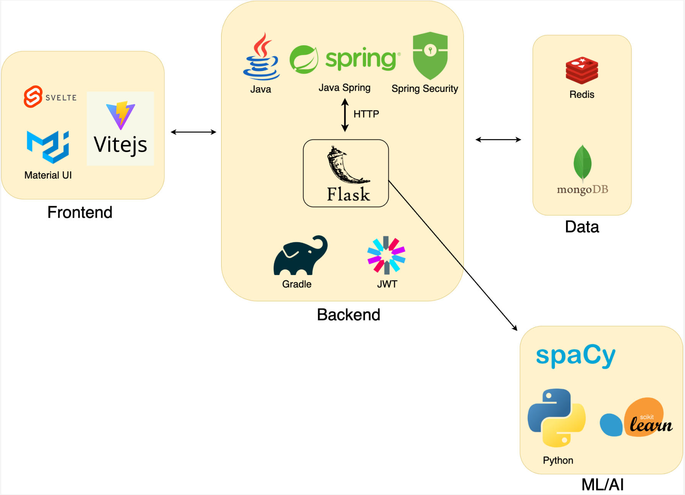

<div align="center">

# 🍏 Fridget Server
**AI-Driven Smart Recipe & Ingredient Management Engine**

**English** | [简体中文](./README_zh-CN.md)

[](#)
[](#)
[](#)
[](#)
[](#)
[](#)
[](#)

*An out-of-the-box, commercial-grade open-source application solving the ultimate "what to eat today" dilemma.*

<br/>


<br/>

👉 **[Explore Fridget Frontend Repository](https://github.com/54853315/fridget-frontend)**

</div>

---

## 📖 Introduction

**Fridget** is an intelligent recipe recommendation engine built on large language models. It not only eliminates the daily stress of deciding what to eat but also champions a **Zero Food Waste** lifestyle.

Simply input the leftover ingredients in your fridge, and Fridget's smart analysis engine will instantly generate customized, step-by-step recipes complete with high-quality images.

> **Acknowledgement**: The core business logic was inspired by the geeky exploration of Sinae Hong's team on YouTube. Building upon that foundation, we have implemented localization adjustments and AI engine upgrades to deliver this mature and stable open-source application.

## ✨ Core Features

- ⚡️ **Blazing Fast Localized AI Engine**: The underlying LLM has been seamlessly migrated to **Qwen3**, optimized for the APAC network environment to provide millisecond-level content generation.
- 🎨 **Immersive Multimedia Experience**: Natively integrated with the PEXELS API, automatically matching high-quality commercial images to AI-generated dishes, bidding farewell to boring plain-text recipes.
- 🧠 **Smart Cache Scheduling**: A 24-hour AI result caching strategy (powered by Redis) drastically cuts API costs and system latency while ensuring recommendation diversity.
- 🧩 **Highly Extensible Hybrid Microservices**:
  - **Core Business Gateway**: Built with Java Spring Boot, providing robust authentication, data persistence (MongoDB), and high-concurrency handling.
  - **AI Inference Service**: Built with Python Flask, combining `scikit-learn` and `spaCy` for NLP processing and vector matching, decoupling heavy computational logic.
- ⚙️ **Granular User Preferences**: The API layer fully supports deep customization of dietary restrictions and taste preferences, delivering truly personalized recipe generation.

## 🏛️ System Architecture

A minimalist yet highly efficient data flow design ensuring perfect decoupling of core business logic and AI computational power.

<div align="center">
  
</div>

---

## 🚀 Getting Started

### 1. Start Redis
```bash
brew services start redis
```

### 2. Start MongoDB

```bash
brew tap mongodb/brew
brew services start mongodb-community
```

### 3. Start Flask Service

(1) Create and activate a virtual environment
```bash
cd FridgetServer/flask
python3 -m venv venv
source venv/bin/activate
```

(2) Install necessary dependencies
  
```bash
# Using Python 3
pip install flask requests spacy scikit-learn
python -m spacy download zh_core_web_md
# If using Python 3.11+, manual installation of the spaCy model is required
# pip3 install zh_core_web_md-3.8.0-py3-none-any.whl
```

(3) Set `ALI_API_KEY` and `PEXELS_API_KEY` according to the comments in `generate_recipes_flask.py`

```bash
export ALI_API_KEY=''
export PEXELS_API_KEY=''
```

**Important**: Please configure `ALI_API_KEY` and `PEXELS_API_KEY` as environment variables to avoid key leakage.

(4) Start Flask service

```bash
python -m flask --app generate_recipes_flask run --host=0.0.0.0 --port=5001 #--debug
```

### 4. Start Spring Boot Service
```bash
cd FridgetServer/
./gradlew compileJava #--stacktrace
./gradlew build
java -jar build/libs/fridget-0.0.1-SNAPSHOT.jar
```

### 4.1 Local Development

```bash
cd FridgetServer/
./gradlew compileJava --stacktrace
./gradlew build --continuous
./gradlew bootRun
```